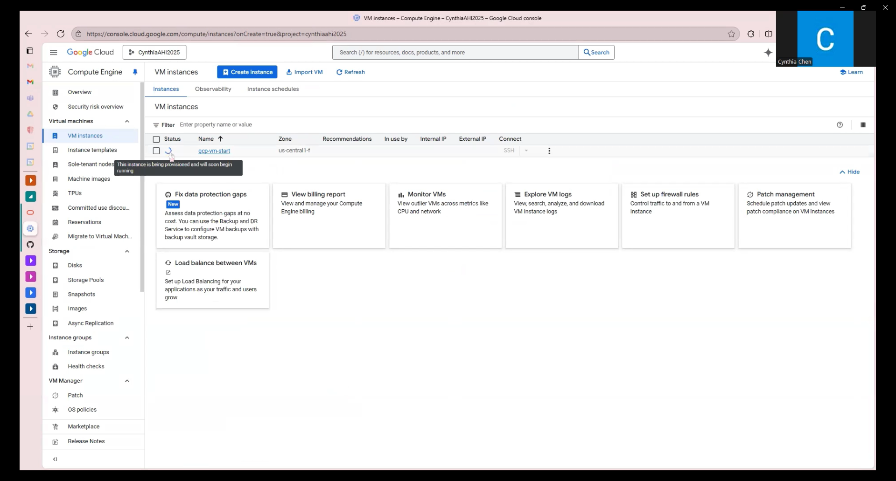
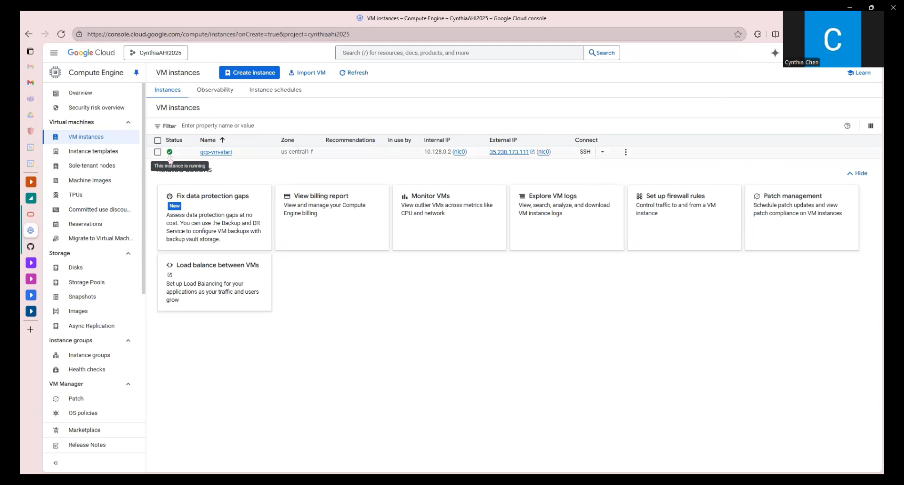
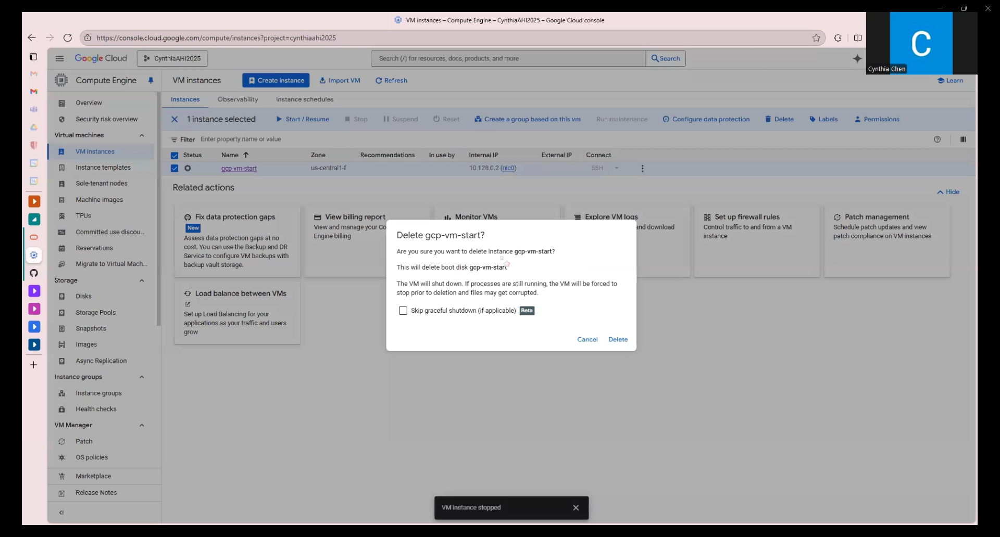
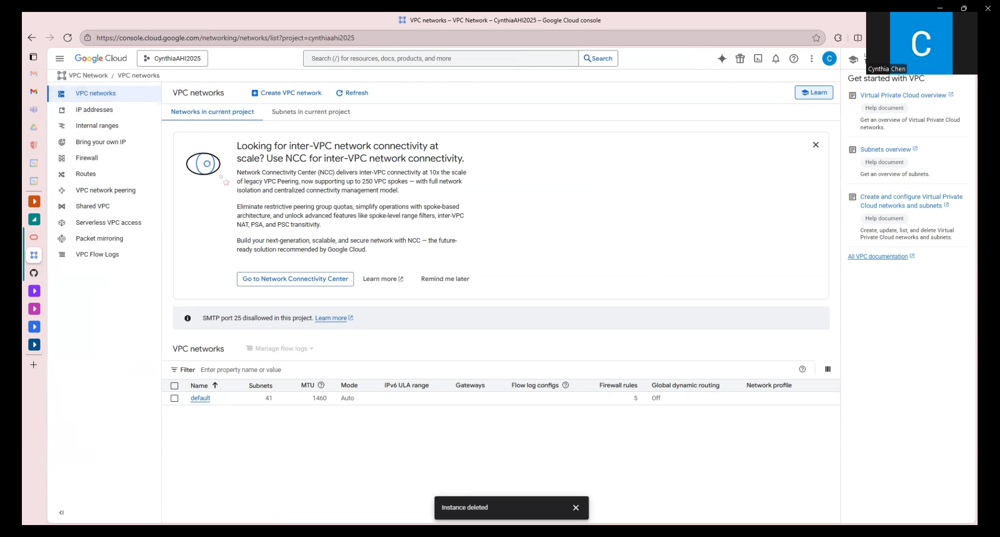
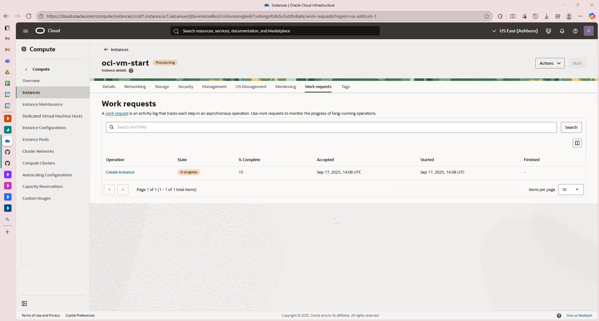
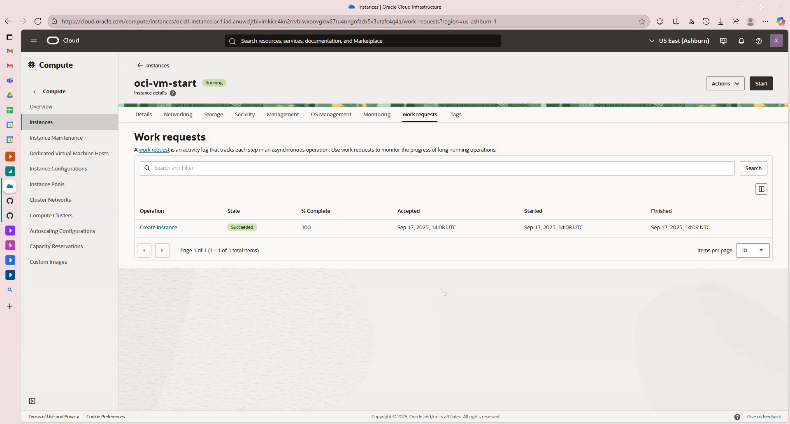
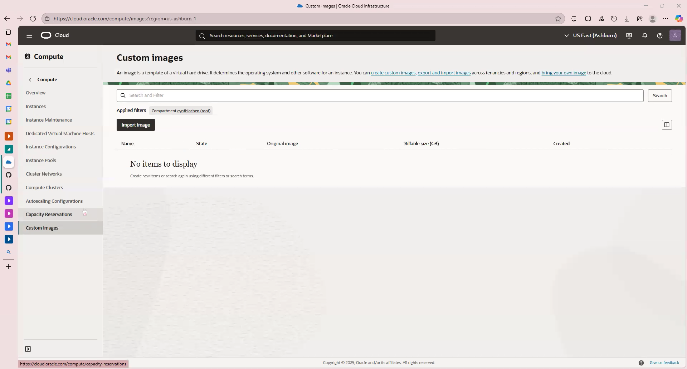

# VM Lifecycle on GCP and OCI — Tutorial

## Video
Google Cloud Platform [GCP]: <paste link>
Orcale Cloud Infrastructure [OCL]: <paste link>

## Prereqs
- Cloud access to GCP and OCI
- No PHI/PII; smallest/free-tier shapes

---

## Google Cloud (GCP)
### Create
1. Console → Compute Engine → Create Instance
2. Region/Zone → Your Choice
3. Machine Type → Smallest Available/Free-Eligible
4. Image → Ubuntu LTS
5. Boot Disk → Default Minimal
6. Network → Default VPC; Ephemeral Public IP

### Start/Stop
- Start: <state shows RUNNING>

- Stop: <state shows TERMINATED/STOPPED>

### Delete
- Delete instance and verify no disks/IPs remain

---

## Oracle Cloud (OCI)
### Create
1. Compartment: <name>
2. Networking: VCN with Internet Connectivity (defaults)
3. Shape: <smallest/free-eligible>
4. Image: Ubuntu (or Oracle Linux)
5. Public IP: ephemeral
6. Boot volume: default minimal

### Start/Stop
- Start: <state shows RUNNING>
- Stop: <state shows STOPPED>

### Terminate
- Terminate and delete boot volume; verify cleanup

---

## Reflections
### Similarities
- <brief bullets>

### Differences
- <brief bullets>

### Preference (OCI vs GCP) and Why
- <one short paragraph>