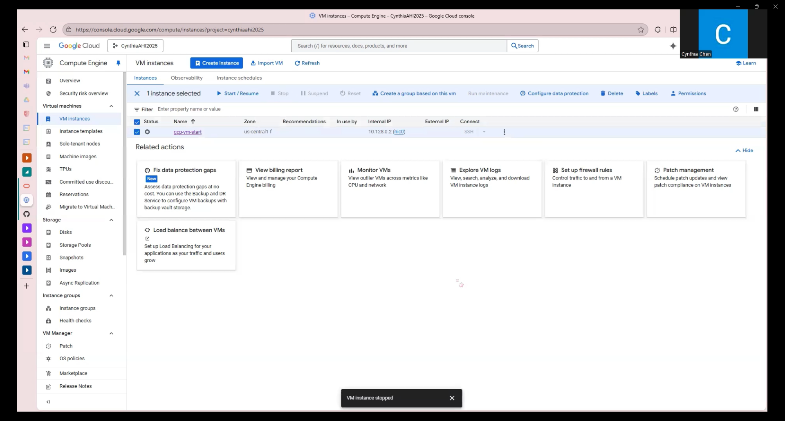
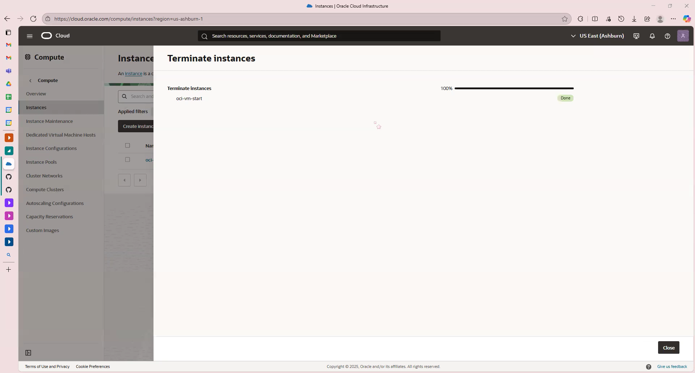

# VM Lifecycle on GCP and OCI — Tutorial

## Video
Google Cloud Platform [GCP]: [Introduction Video To Create Virtual Machine](https://drive.google.com/file/d/1Ta3cMSXcutVz39Frd7cqVK_vkcEPIdvW/view?usp=sharing)

Orcale Cloud Infrastructure [OCL]: [Introduction Video To Create Virtual Machine](https://drive.google.com/file/d/1Y2YzTbSIy71j1g1LEN_vK3ZbFCxOk_3e/view?usp=sharing)

## Prereqs
- Cloud access to GCP and OCI
- No PHI/PII; smallest/free-tier shapes

---

## Google Cloud (GCP)
### Create
1. Console → Compute Engine → Create Instance
2. Region/Zone → Your Choice
3. Machine Type → Smallest Available/Free-Eligible
4. Image → Ubuntu LTS
5. Boot Disk → Default Minimal
6. Network → Default VPC; Ephemeral Public IP

### Start/Stop
- Start: <State shows RUNNING>

- Stop: <State shows STOPPED>

### Terminate & Verify Cleanup
- Terminate boot volume; verify cleanup

- Terminate: 

- Cleanup Check 

---

## Oracle Cloud (OCI)
### Create
1. Compartment → Defult
2. Networking → VCN with Internet Connectivity (defaults)
3. Shape → Smallest/Free-Eligible
4. Image → Ubuntu (or Oracle Linux)
5. Public IP → Ephemeral
6. Boot volume → Default Minimal

### Start/Stop
- Start: <state shows RUNNING>

- Stop: <state shows STOPPED>

### Terminate
- Terminate boot volume; verify cleanup

- Terminate: 

- Cleanup Check 

---

## Reflections
### Similarities
- Built-in Cloud Shell 
- Container Models for Resources
- Support Multi-Regions

### Differences
GCP - Google Cloud 
- Minimalist Style
- "Pin to Navigate" 
- Connected to Google Accounts

OCI - Oracle Cloud 
- Enterprise Style 
- Customizable Dashboard
- Tailored to Oracle Workloads

### Preference (OCI vs GCP) and Why
Google Cloud Platform (GCP) is my preferred option due to its user-friendly interface. The user interface is clear, simple, and easy to use, which makes it more appropriate for everyday use and quick learning. Additionally, the search bar for locating and starting services is faster than Oracle's, which has more complex menus. All things considered, GCP offers a more developer-friendly experience with minimal setup, making it ideal for innovative and agile projects.